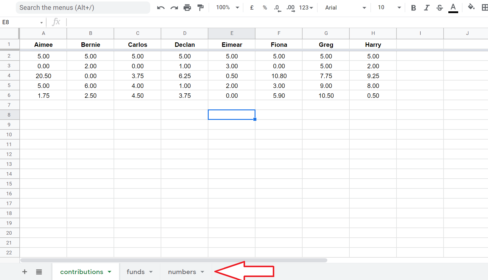
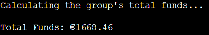
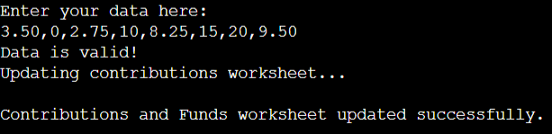

# Lotto Tracker

Welcome to Lotto Tracker Data Automation! This program is a useful tool for a group who wants to manage finance in a lottery syndicate. This aims to help the group leader or treasurer to retrieve financial data, get random numbers for lottery, add contributions and manage withdrawals from the funds.

## Program Flow Chart ##

This program flow chart is a guide on how the program flows. The chart was made using Lucid Chart - [https://www.lucidchart.com/]. 

## Data Storage ##

All the data that is retrieved, updated and is inputted by the user is stored in Google Sheets - [https://www.google.com/sheets/about/]. There are three worksheets including the `contributions`, `funds`, and `numbers`. These worksheets store data for the program so the user can retrieve, update and input information for the lottery syndicate.

## How To Use ##

The program is initiated automatically when opened in the browser. The main menu is then presented to the user. There are 8 different options that the user can choose from.

The user can then input the correct number from the menu to perform the specific program function.

## Program Functions ##

- ### Check Group Total Funds ###
    - This function simply calculates the total amount of money from each individual member's current funds. This is then displayed for the user.

        

- ### Lucky Numbers ###
    - This function generates random six numbers that the group can use for a bet in the lottery. This is then displayed for the user.

        

- ### Input Lotto Win ###
    - This function asks the user to input the amount of lotto win for the group. It is then automatically divided equally to all members of the lottery syndicate. The funds worksheet is then updated.

        

- ### Check Last Numbers ###
    - This function displays the last lucky numbers of he group.

        

- ### Check Member Funds ###
    - This function displays the last lucky numbers of he group.

        

- ### Add Member Contribution ###
    - This function asks the user to input contribution from the members. A short guide for a valid user input is dispalyed before inputting the contributions data.

        

    - Contributions are added in one go. If there's a member who has no contribution for the day, a value of `0` is inputted for a specific member.

        

- ### Withdraw Money for A Member ###
    - This function allows the user to update the funds when a member decides to withdraw money their current funds. Firstly, the user is asked to choose from the menu which member wants to do a withdrawal.

        

    - After the user decides which member wants to withdraw an amount, a confirmation message is displayed. If the user confirms, the withdrawal operation is done, and the funds worksheet is updated.

        
        

## Bugs ##
- No bugs identified.

 

## Deployment ##
- The site was deployed to GitHub pages. The steps to deploy are as follows:
    - Open a web browser (like Chrome, Firefox or Edge)
    - Login to Github and locate repositories.
    - In the GitHub repository, navigate to the Settings tab.
    - Go to pages tab and from the source section drop-down menu, select the main Branch and then click save button.
    - Once the main branch has been selected and saved, the page provided a link the completed website. 
The live link can be found here - https://jtm2021.github.io/keto-bubble/

 

### Content Information ###

- The site content information are sourced from various websites. See links below:
    - https://en.wikipedia.org/wiki/Ketogenic_diet
    - https://www.healthline.com/nutrition/clean-keto
    - https://www.dietdoctor.com/low-carb/keto?c_source=google&c_medium=cpc&gclid=CjwKCAjwz5iMBhAEEiwAMEAwGO39PfZgHdnpMUs1EehYgTpItvdHwwnyJhr2al-O4nA8NvFublPKfxoCkmgQAvD_BwE

    

``REMINDERS: 1. please provide reference for codes "{:.2f}".format - float``
     
