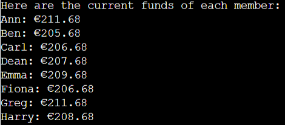
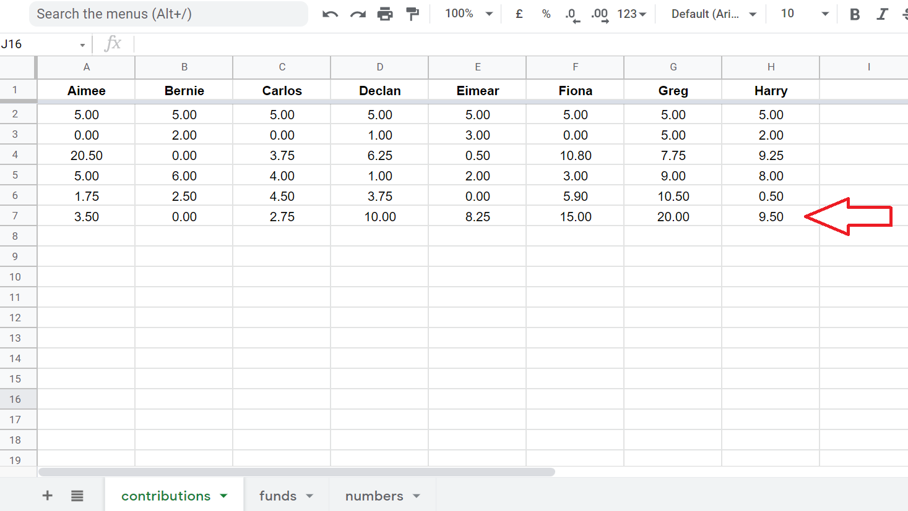

# Lotto Tracker

Welcome to Lotto Tracker Data Automation! This program is a useful tool for a group who wants to manage financial data in a lottery syndicate. This aims to help the group leader or treasurer to retrieve financial data, get random numbers for lottery, add contributions and manage withdrawals from the funds.

It uses Python programming that runs in the Code Institute mock terminal on Heroku. Below is the screenshot of the project run in different devices.

## Program Flow Chart ##

This flow chart is a guide on how the program flows from start to end. The chart was made using Lucid Chart - [https://www.lucidchart.com]. 

## Data Storage ##

All the data that is retrieved, updated and is inputted by the user is stored in Google Sheets - [https://www.google.com/sheets]. There are three worksheets including the `contributions`, `funds`, and `numbers`. These worksheets store data for the program so the user can retrieve, update and input information for the lottery syndicate.

## Python Library ##

I have installed `random` library in order for this project to work:
- _random_ - used to generate random six numbers for the user between 1 and 47.

## Application Programming Interface ##

I have used two API's for this project to access and share data:

- *Google Drive API*

- *Google Sheets API*

 

## How To Use ##

The program is initiated automatically when opened in the browser. The main menu is then presented to the user. There are 8 different options that the user can choose from.

The user can then input the correct number from the menu to perform the specific program function.

## Program Functions ##

- ### Check Group Total Funds ###
    - This function simply calculates the total amount of money from each individual member's current funds. This is then displayed for the user.

        
        

    - In the image above, the highlighted row is the current individual member funds where the first row displays the name of each member.
    - The first program function calculates the sum of all values in the second row which is highlighted in green color. You can see in the image below, that the operation returns a correct amount when all of these values are summed up using a `sum` function in google sheets.

        

- ### Lucky Numbers ###
    - This function generates random six numbers that the group can use for a bet in the lottery. This is then displayed for the user. These numbers are immediately saved in the `numbers worksheets`.

        
        
    

- ### Input Lotto Win ###
    - This function asks the user to input the amount of lotto win for the group. It is then automatically divided equally to all members of the lottery syndicate. The `funds worksheet` is then updated.

        
        

- ### Check Last Numbers ###
    - This function displays the last lucky numbers of the group. When the user selects this function it retrieves the last six numbers that were randomly generated by the program which are saved in the `numbers worksheet`.

        
        

- ### Check Member Funds ###
    - This function displays the individual member's funds. It retrieves the first row of the funds worksheet and displays it for the user.

        
        

- ### Add Member Contribution ###
    - This function asks the user to input contribution from the members. A short guide for a valid user input is dispalyed before inputting the contributions data.

        

    - Contributions are added in one go. If there's a member who has no contribution for the day, a value of `0` is inputted for a specific member.

        
        
        

- ### Withdraw Money for A Member ###
    - This function allows the user to update the funds when a member decides to withdraw money from their current funds. Firstly, the user is asked to choose from the menu which member wants to do a withdrawal.

        

    - After the user decides which member wants to withdraw an amount, a confirmation message is displayed. If the user confirms, the withdrawal operation is done, and the funds worksheet is updated. The withdrawal that was done is reflected in a negative value in the last row of the funds worksheet. The member's funds is also automatically updated in the second row of the worksheet. The value reflected for the other members is `0` since only one member of the group made the withdrawal.

        
        

    - If the user do not confirm to do the withdrawal, a question is then displayed asking the user if they want to do another operation or not. It will go back to the main menu if the user answers `yes` and it will end the program if the user answers `no`.

        

## Testing ##
I have manually tested this program by doing the following:

- I have passed the code through a PEP8 linter (http://pep8online.com/) and I have confirmed that there are no issues with the code.

    

- I have also tested it in my local terminal and the Code Institute Heroku Terminal and I have confirmed that there are no bugs in the codes.

 

## Deployment ##

- The project was deployed using the Code Institute's terminal for Heroku. These are steps for the deployment of the project:
    1. Create an account in `Heroku` website - https://heroku.com
    2. Click the link provided in the confirmation email sent by 
    Heroku to confirm.
    3. Set the password and accept their terms of service.
    4. From the Heroku dashboard, click `Create new app` button.
    5. Create a name for the app (the app name has to be unique).
    6. Select a region (United States or Europe), then click create app.
    7. Go to `Settings` tab and add two `Config Var`:
        - key: `CREDS` and value: `(entire creds.json file from your workspace)`
        - key: `PORT` and value: `8000`
    8. Still in the `Settings` tab, add `python` and `nodejs` buildpacks.
    9. Go to `Deploy` tab and select Github  by clicking the `Connect to Github` button.
    10. Type the Github repository name in the field and click search and then click connect to link up Heroku app to Github repository code.
    11. Scroll down and select either `automatic` or `manual` deployment:
        - Automatic Deployment: Click the `Enable Automatic Deploys` button.
        - Manual Deployment: Click the `Deploy Branch` button.
    12. Wait until "Your app was successfully deployed" message to appear.
    13. Click the `View` button to open the mock terminal.

 

- The live link can be found here - https://lotto-tracker.herokuapp.com/

 

### Credits ###

- This project was inspired by the `Love Sandwiches Project` of Code Institute.
- An important code to format a string was taken from `ThePythonGuru` website. The link is here:
    https://thepythonguru.com/python-string-formatting/
