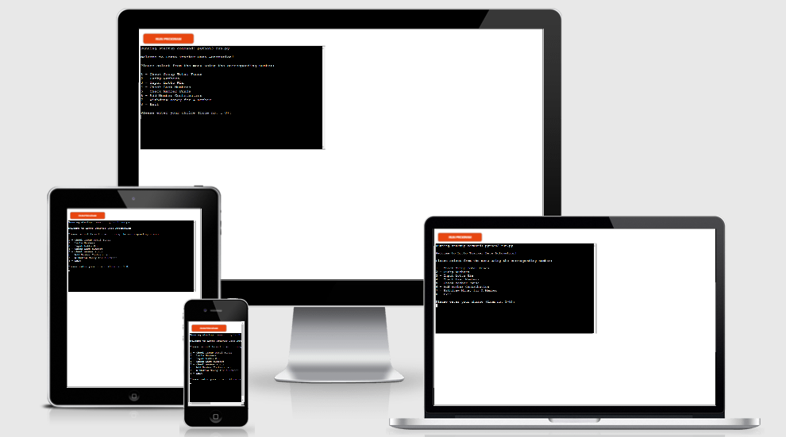

# Lotto Tracker

Welcome to Lotto Tracker Data Automation! This program is a useful tool for a group who wants to manage finance in a lottery syndicate. This aims to help the group leader or treasurer to retrieve financial data, get random numbers for lottery, add contributions and manage withdrawals from the funds.

## How To Use ##

The program is initiated automatically when opened. The main menu is then presented to the user. There are 8 different options that the user can choose from.

The user can then input the correct number from the menu to perform the specific program function.

## Program Flow Chart ##

## Program Functions ##

- ### Check Group Total Funds ###
    - This function simply calculates the total amount of money from each individual member's current funds. This is then displayed for the user.

 

## Testing ##

- I have tested this page in three different browsers including Chrome, Firefox and Microsoft Edge.
    - Firefox 

    

    - Microsoft Edge

    

    - Google Chrome

    

- I confirmed that the project is responsive and functions in various screen sizes using the devtools device toolbar.
    - Laptops

    

    - Tablets

    
    
    - Phones

    
    
- I confirmed that the features of the website including the navigation bar, heading, contents and other sections are completely clear and easy to understand.
- I have confirmed that the contact form works and that each input field will only accept the required details from the users and that the send message button works correctly.

 

### Bugs ###
- No bugs identified.

### Validator Testing ###
- HTML - No errors were returned when passing through the official [**W3C validator**](https://validator.w3.org/#validate_by_input+with_options)
    - Main Page
        
    - About Page
        
    - Contact Page
        

- CSS - No errors were found when passing through the official [**(Jigsaw) validator**](https://jigsaw.w3.org/css-validator/#validate_by_input)
    - 

 

## Deployment ##
- The site was deployed to GitHub pages. The steps to deploy are as follows:
    - Open a web browser (like Chrome, Firefox or Edge)
    - Login to Github and locate repositories.
    - In the GitHub repository, navigate to the Settings tab.
    - Go to pages tab and from the source section drop-down menu, select the main Branch and then click save button.
    - Once the main branch has been selected and saved, the page provided a link the completed website. 
The live link can be found here - https://jtm2021.github.io/keto-bubble/

 

## Credits ##

### Content ###
- Some codes were inspired by the Love Running Project.

### Media ###

- The images included in the website were taken from [Pexels.com](https://www.pexels.com/). The links are provided below:
    - https://www.pexels.com/photo/hamburger-and-fries-photo-2983101/
    - https://www.pexels.com/photo/salmon-dish-with-vegetables-1516415/
    - https://www.pexels.com/photo/man-pouring-drink-on-woman-s-glass-3184181/
    - https://www.pexels.com/photo/assorted-vegetable-lot-1300972/
    - https://www.pexels.com/photo/woman-slicing-gourd-1153369/
    - https://www.pexels.com/photo/photo-of-vegetables-and-fruit-on-table-4117543/
    - https://www.pexels.com/photo/photo-of-vegetable-salad-in-bowls-1640770/
    - https://www.pexels.com/photo/white-and-black-number-3-5242266/
    - https://www.pexels.com/photo/photo-of-sliced-cheese-on-wooden-surface-4087609/

### Content Information ###

- The site content information are sourced from various websites. See links below:
    - https://en.wikipedia.org/wiki/Ketogenic_diet
    - https://www.healthline.com/nutrition/clean-keto
    - https://www.dietdoctor.com/low-carb/keto?c_source=google&c_medium=cpc&gclid=CjwKCAjwz5iMBhAEEiwAMEAwGO39PfZgHdnpMUs1EehYgTpItvdHwwnyJhr2al-O4nA8NvFublPKfxoCkmgQAvD_BwE

    

# REMINDERS:
    1. please provide reference for codes "{:.2f}".format - float
    2.Clearly separate and identify code written for the application and code from external sources (e.g. libraries or tutorials)
    3. Don't forget flowchart of the program

Welcome jtm2021,

This is the Code Institute student template for deploying your third portfolio project, the Python command-line project. The last update to this file was: **August 17, 2021**

## Reminders

* Your code must be placed in the `run.py` file
* Your dependencies must be placed in the `requirements.txt` file
* Do not edit any of the other files or your code may not deploy properly

## Creating the Heroku app

When you create the app, you will need to add two buildpacks from the _Settings_ tab. The ordering is as follows:

1. `heroku/python`
2. `heroku/nodejs`

You must then create a _Config Var_ called `PORT`. Set this to `8000`

If you have credentials, such as in the Love Sandwiches project, you must create another _Config Var_ called `CREDS` and paste the JSON into the value field.

Connect your GitHub repository and deploy as normal.

## Constraints

The deployment terminal is set to 80 columns by 24 rows. That means that each line of text needs to be 80 characters or less otherwise it will be wrapped onto a second line.

-----
Happy coding!